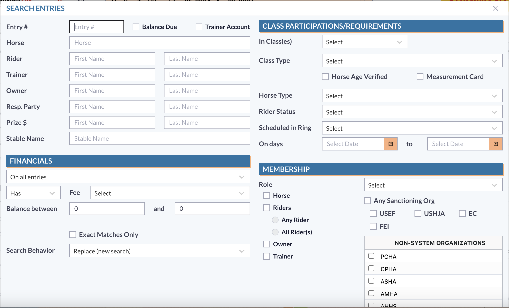

# List View Shortcuts

## Show Subset: "Cmd + U"/ "Ctrl + U" (Mac/Windows)

When using this shortcut option, the user will need to highlight a selection of records that they want to see separate from the entire list.&#x20;

<figure><figcaption></figcaption></figure>

Once the user has this selection of records, using the "Cmd + U"/ "Ctrl + U" option will show only those selected records in the list.&#x20;

<figure><figcaption></figcaption></figure>

## Show All Results: "Cmd + G"/ "Ctrl + G" (Mac/Windows)

When a user has created a subset of records in a list view and wants to go back to the full list view of records, the shortcut to do this is by using "Cmd + G"/ "Ctrl + G".&#x20;

<figure><figcaption></figcaption></figure>

This will change the view from the subset selection to all records.&#x20;

<figure><figcaption></figcaption></figure>

## Print Results: "Cmd + P"/ "Ctrl + P" (Mac/Windows)

Using the shortcut "Cmd + P"/ "Ctrl + P" will bring up the Printable Reports for that specific module.&#x20;

<figure><figcaption></figcaption></figure>

The user can then choose the specific report that is needed and print.&#x20;

## Select All Results: "Cmd + A"/ "Ctrl + A" (Mac/Windows)

If a user needs to select all of the items from the list view, this can be acheived by highlighting a record and hitting "Cmd + A"/ "Ctrl + A".&#x20;

Using this shortcut will highlight all of the records in the list view.&#x20;

<figure><figcaption></figcaption></figure>

## New Record: "Cmd + B"/ "Ctrl + B" (Mac/Windows)

The shortcut "Cmd + B"/ "Ctrl + B" can be used to create a new record in the module the user is working out of.&#x20;

When using the shortcut, the system will open the input form to add a new record.

<figure><figcaption></figcaption></figure>

The user can then input the information needed for the new record and save.

## Open Advanced Search Dialog: "Cmd + F"/ "Ctrl + F" (Mac/Windows)

When a user needs to use the advanced search in a module, opening that search form can be completed by using the shortcut "Cmd + F"/ "Ctrl + F".&#x20;

<figure><figcaption></figcaption></figure>

The user can then enter the specifics for the records that are being looked for and run the search.&#x20;

## Navigate Results: ArrowUp and ArrowDown

Navigating records through the list can be completed by using the arrow up and down. \
This will allow the user to move through records one item at a time.&#x20;

<figure><figcaption></figcaption></figure>

<figure><figcaption></figcaption></figure>

## Open Record: ENTER

Opening a record with a shortcut can be completed by using the enter button. Highlighting the record and then choosing enter will open that individual record.&#x20;

<figure><figcaption></figcaption></figure>

<figure><figcaption></figcaption></figure>
