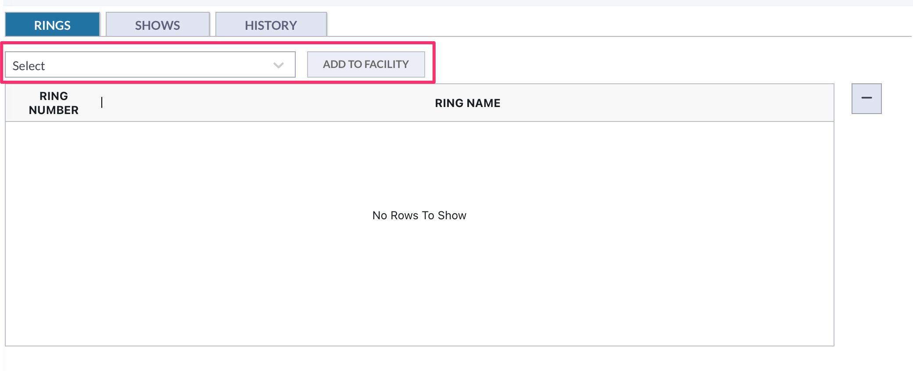
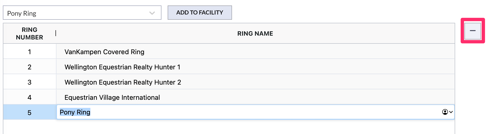

# Facilities

## Important Changes

1. Facilities and Rings now work out of two different modules. Users can set up a new facility, but in order to add rings to the facility, the user must create the rings in the Rings module. The user will then be able to select specific rings for the facility.&#x20;
2. When looking at a facility's record, users can see every show that the facility was used for and any changes that have been made to that particular facility.&#x20;
3. The Rings module serves as the default for rings. In the facility, rings can be renamed for that particular facility use.&#x20;

## List View

Opening the Facilities module will show you the existing facilities for your show company.

<figure><figcaption>
Facility List View
</figcaption></figure>

In this section, if you need to search for a specific facility, you can input the facility name in the search box to find the facility you are looking for.&#x20;

<figure><figcaption></figcaption></figure>

### Existing Facilities

Opening an existing facility will show you all of the information for the facility at the top of the facility screen.

<figure><figcaption></figcaption></figure>

The Facility record has 3 subsections,  Rings, Shows, and History.

<figure><figcaption>
Facility Tabs - Sections
</figcaption></figure>

#### Rings

The Rings tab is where you can see and manage the rings for that particular facility.

<figure><figcaption></figcaption></figure>

Every Ring has a default name but you can change the name of the ring in this tab. This will not change the default name of the ring, but will change the name of the ring when it is used in this facility.&#x20;

#### Shows

The Shows tab will list every show that the facility has been used for.

<figure><figcaption></figcaption></figure>

#### History

The History tab will show any changes to the facility, the date and time of the change, and the user who made the change.&#x20;

\

<figure><figcaption></figcaption></figure>

### Creating a New Facility

If you need to create a new facility, this is done by choosing the Add option at the top of the page.&#x20;

<figure><figcaption></figcaption></figure>

This will bring you to the page to input all of your information for your facility.&#x20;

<figure><figcaption></figcaption></figure>

You will notice as you are inputting your information on this page, the "Number of Rings" shows as blank. Once you have created your facility and saved it, you will then be able to add your rings and the number of rings associated to your facility will be updated.&#x20;

Once you have saved your facility, opening it back up will allow you to add rings. You will now see at the bottom of the page a section to add your rings.&#x20;

<figure><figcaption></figcaption></figure>

In this section, there is a dropbox that will list every ring that is in the system for your specific show company.&#x20;

<figure><figcaption></figcaption></figure>

To add a ring, you will choose the specific ring from the dropbox and then choose the "Add to Facility" button.&#x20;

<figure><figcaption></figcaption></figure>

Once you add the ring, it will show in the rings list of that specific facility.&#x20;

<figure><figcaption></figcaption></figure>

If you want to remove the ring, you will simply highlight the ring and hit the minus sign on the right side of the page.&#x20;

<figure><figcaption></figcaption></figure>

When you have finished your changes to your facility, you will want to hit the save button.&#x20;

<figure><figcaption></figcaption></figure>

Once your new facility is created, it will be available to select when setting up a new show. Each facility that is in the system, will show in the facility dropbox in the General tab of the show.

<figure><figcaption></figcaption></figure>
