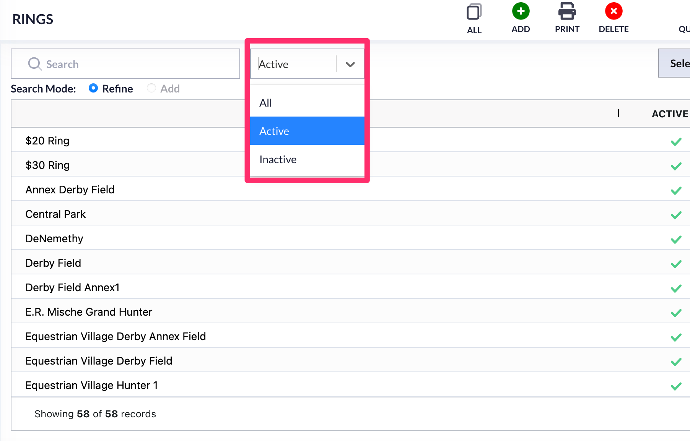

# Rings

Important Changes

In the old system, rings worked within the facility module. Rings are still used in facilities, but creating new rings is done in the Rings module. Once a ring is created, it can be added to a facility.&#x20;

## How Rings Work With a Facility

When creating a new facility in the system, the user must create the rings for that facility in the Rings module.&#x20;

<figure><figcaption></figcaption></figure>

The rings that will be used in a show have to be created before you can associate them to a show facility.&#x20;

## List View

Going to the Rings module will show you the specific rings that are already being used for your show company.&#x20;

<figure><figcaption></figcaption></figure>

The default list view of rings will show all active rings. There is now a filter to differentiate between active and inactive rings.&#x20;

&#x20;

<figure><figcaption></figcaption></figure>

### Existing Rings

Opening an existing ring will allow you to see what facilities they are tied to, which shows they have been used in, and any editing history.&#x20;

<figure><figcaption></figcaption></figure>

<figure><figcaption></figcaption></figure>

### New Ring

Creating a new ring is done by clicking the Add button at the top of the page.&#x20;

<figure><figcaption></figcaption></figure>

This will bring up the page to name your ring. You will also want to mark the ring as active. Once you have completed this, you will save the new ring.&#x20;

<figure><figcaption></figcaption></figure>

For a ring to be able to be used, it must be marked as active.&#x20;

<figure><figcaption></figcaption></figure>

Once you have rings created, users can add those rings into a facility in the "Facilities" module.&#x20;

