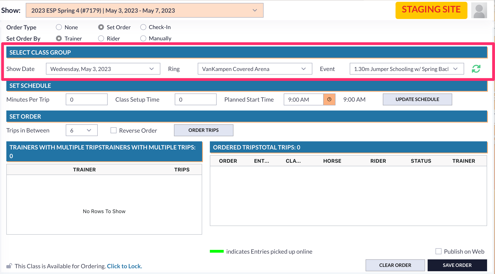
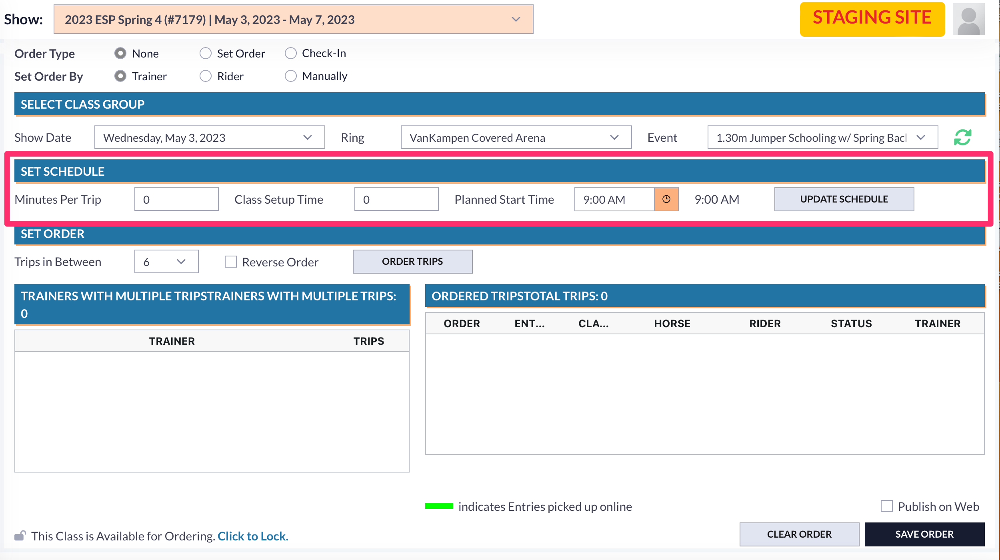

# 📋 Order of Go

## Accessing Order of Go

The Order of Go tool is found in the Tools section of the menu.

<figure><figcaption></figcaption></figure>

## Using the Order of Go Tool

### Show Selection

When you first open the Order of Go Tool, you will want to make sure you are working out of the correct show. This is done at the very top of the page. There is a show dropbox to select each show week.&#x20;

<figure><figcaption></figcaption></figure>

### Order Type

Once you have determined you are working in the correct show, you will need to set your order type. There are three types of order. These are None, Set Order, and Check-In.&#x20;

<figure><figcaption></figcaption></figure>

How your order type is set will determine if there is no order to the class, if the user is setting the order manually, or if exhibitors will set their own order on the web.&#x20;

### Set Order By

The Set Order By option has three selection choices. Users can choose to set the order of a class by using the trainer as the reference for entries, the rider as the reference for entries, or setting the order without using any references for the entries.&#x20;

<figure><figcaption></figcaption></figure>

Determining how the order is going to be set by will change the list of unordered trips to show by the specific set classification.

### Select Class Group

Once you have made your selections of the show you are working out of, the order type, and how the order is being set by, you will need to choose the specific class group you are wanting to set the order of go for.&#x20;

This section has three dropboxes. These dropboxes allow you to select the show date, the ring, and the specific event or class.

<figure><figcaption></figcaption></figure>

As you are selecting your class group, if the events do not load correctly in that dropbox, there is a refresh button in this section to correctly load those events.

### Set Schedule

The Set Schedule option allows users to continue working in the Order of Go tool without having to move to a different tool.&#x20;

The user can set the minutes per trip, that class setup time, and the planned start time. This allows the user to set the class group in the schedule without leaving to go to a different tool.&#x20;

<figure><figcaption></figcaption></figure>

Once you have set the schedule how you want it, you can choose the Update Schedule option and it will update that class group on the schedule.&#x20;

### Set Order

This section of the tool is where you will see the lists of trainers with multiple trips, riders with multiple trips, or un-ordered trips. These trips will be sorted by the user's choice in Set Order By option.

With whatever choice the user selects to set the order by, the list on the right side of the page will show the ordered trips. The user can&#x20;

#### Set Order By Trainer

When you have the Trainer selected as your basis for setting the order, the unordered trips will distinguish between entries by the trainer and show trainers who have multiple entries.&#x20;

<figure><figcaption>
This is an example of the title of that unordered list of trips. 
</figcaption></figure>

<figure><figcaption>
In this example, you can see that there are 4 trainers with multiple trips. It also tells you how many trips each of those trainers are associated with. 
</figcaption></figure>

Each trainer's entries are color-coded so you can easily place those entries in the ordered list.&#x20;

You can select the number of trips you want between each trainer's trips from the Trips in Between dropbox. Once you have&#x20;

#### Set Order By Rider

When the order is being set by the rider as the basis, that unordered list will change to show the riders who are entered in the class with multiple horses.

<figure><figcaption></figcaption></figure>

Each rider will be color-coded like the trainer selection. This section will also show how many trips each rider has in the class and there is a dropbox to select the specific horse.&#x20;

#### Set Order Manually

The last option for setting the order is manually. This provides the list of any unordered trips to the left side of the page and the ordered trips on the right side.&#x20;

<figure><figcaption></figcaption></figure>

### Order of Go Lock

There is an option in the order of go to lock and unlock the order.&#x20;

This tool allows users to completely lock the order once it has been set. When the order is locked, the system will tell the user that it is locked. If any changes need to be made, the user can unlock the order.&#x20;

<figure><figcaption></figcaption></figure>

Once the user has made any changes to the order, they can choose to lock the order again from being changed.&#x20;

<figure><figcaption></figcaption></figure>
