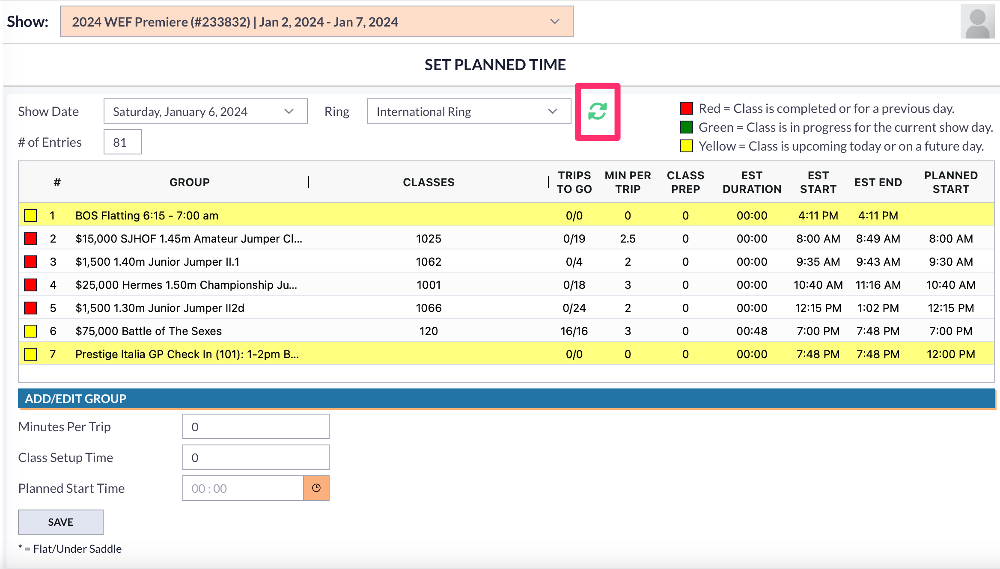

# ⏱️ Set Planned Time

## Important Changes

In the old announcer tool, the user had the option to make minor edits to the schedule. This was found in the schedule tab of the Announcer Interface.&#x20;

<figure><figcaption></figcaption></figure>

Choosing the edit tab allowed the user to make edits to the minutes per trip, class setup time, and the planned start time.&#x20;

<figure><figcaption></figcaption></figure>

Now, this Set Planned Time is it's own tool.

## Accessing the Cloud "Set Planned Time" Tool

The Set Planned Time tool is found in the Tools list at the bottom. This tool is available for users in the Ingate and Announcer group.&#x20;

<figure><figcaption></figcaption></figure>

## How to Use the Set Planned Time Tool

When you open the tool you will see a schedule page.&#x20;

<figure><figcaption></figcaption></figure>

### Items to Double Check

To use the tool correctly, the user must make sure that the correct show is selected from the dropbox at the top of the page.&#x20;

<figure><figcaption></figcaption></figure>

The user will then need to make sure the correct date and ring are selected.&#x20;

<figure><figcaption></figcaption></figure>

If the user changes the show date and/or the ring and the class groups do not change, the user can hit the refresh button to pull up the correct classes for that particular date and ring.&#x20;

<figure><figcaption></figcaption></figure>

### Making Edits to Classes&#x20;

Once the user has made sure the above information is accurate, they can select the groups they want to edit.

To make any edits, the user must highlight the class/class groups. A highlighted class will show the information in the bottom section that is currently set for that class.&#x20;

<figure><figcaption></figcaption></figure>

If any changes are needed, the user can make those changes in the bottom section of that page. The items that are allowed to be edited are Minutes per Trip, Class Setup Time, and the Planned Start Time.&#x20;

<figure><figcaption></figcaption></figure>

Once the edits have been made, the user will hit save and the changes will show in that class group.&#x20;
